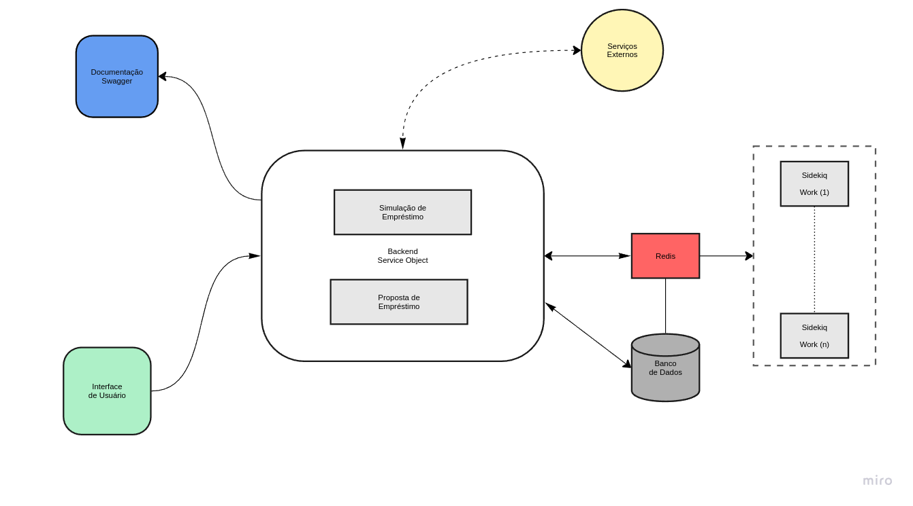

## 🌐 Informações
### Problema
- Você deverá criar uma aplicação backend para um simulador de crédito que permita aos usuários simular empréstimos, visualizando as condições de pagamento baseadas no valor solicitado, taxa de juros e prazo de pagamento.

## ⛁ Modelo de arquitetura


## 🛠 Requisitos
Antes de começar, certifique-se de ter os seguintes requisitos instalados:

- [Git](https://git-scm.com/)
- [Ruby 3.2.O](https://www.ruby-lang.org/pt/downloads/)
- [PostgreSQL](https://www.postgresql.org/)
- [Redis](https://redis.io/downloads/)

Outras configurações
- [Docker](https://www.docker.com/get-started)
- [Docker Compose](https://docs.docker.com/compose/)

Agora, clone o repositório:

```bash
# Via SSH
git clone git@github.com:arlymoura/ChackoutSimulation.git

# Via HTTPS
git clone https://github.com/arlymoura/ChackoutSimulation.git
```

---

## ⚙️ Configuração

Acesse o diretório do projeto e siga os passos abaixo:

1️⃣ **Instale as dependências:**
```bash
bundle install
```

2️⃣ **Configure as variáveis de ambiente:**
```bash
cp .env.example .env
```
> **Edite o arquivo `.env` conforme necessário.**

3️⃣ **Execute as setup iniciais:**
```bash
bin/setup

ou

rails db:create db:migrate
```

6️⃣ **Inicie o servidor:**
```bash
rails server

em outra aba rode

bundle exec sidekiq

```

---

## 🐳 Configuração do Docker

1️⃣ **Subir o container:**
```bash
docker-compose up
ou
docker compose up
```
Isso irá iniciar o sistema na porta **3000**.

2️⃣ **Forçar a reconstrução da imagem:**
```bash
docker-compose up --build
ou
docker compose up --build
```
Se houver mudanças no código, esta opção garante que o Docker reconstrua a imagem antes de rodar o container.

3️⃣ **Parar a execução dos containers:**
```bash
docker-compose stop
ou
docker compose stop
```
Isso pausa os containers sem removê-los.

4️⃣ **Remover os containers e liberar recursos:**
```bash
docker-compose down
ou
docker compose down
```
Essa opção desliga e remove os containers, redes e volumes criados pelo docker-compose up.

OBS: Ajuste as configurações do arquivo `.env`, e caso queira usaro `postgres` mude a configuração do arquivo `config\database.yml`(Deixei um exemplo de como usar)

---

## 🔧 Scripts úteis

### ✅ Executar testes automatizados
```bash
rspec spec
```
### ✅ Executar testes automatizados via docker
```bash
docker compose run --rm test
```

### 🛠 Ferramentas Medir a Cobertura de Testes
- **Coverage: Para verificar a cobertura**
  - Acesse a pasta na raiz do projeto chamada `coverage`
  - Abra o arquivo chamado `index.html` em seu navegador

---

## 🎯 Endpoint: Simulação de Empréstimo

**URL:** `/api/v1/loans/simulations`
**Método:** `POST`

### 🔐 Headers necessários

- `Content-Type: application/json`

---

### 📥 Request Body

| Campo           | Tipo    | Obrigatório | Descrição                              |
|-----------------|---------|-------------|----------------------------------------|
| loan_amount     | Number  | Sim         | Valor do empréstimo.                   |
| term_in_months  | Integer | Sim         | Número de parcelas.                    |
| birth_date      | String  | Sim         | Data de nascimento                     |

**Exemplo de request:**

```json
{
  "loan_amount": 10000,
  "birth_date": "2005-06-08",
  "term_in_months": 24
}
```

**Exemplo de Retorno:**
```json
{
  "payment_per_month": 438.71,
  "total_paid": 10529.04,
  "total_interest": 529.04,
  "annual_interest_rate": 5.0
}
```
--

## 📬 Endpoint: Criar um Lote de Simulações
**URL:** `/api/v1/loans/simulation_batches`
**Método:** `POST`

### 🔐 Headers necessários

- `Content-Type: application/json`

---

### 📥 Request Body

| Campo           | Tipo    | Obrigatório | Descrição                              |
|-----------------|---------|-------------|----------------------------------------|
| email           | String  | Não         | Email para o qual os resultados do lote|
|                 |         |             | serão enviados em formato CSV após o   |
|                 |         |             |  Processamento                         |
| sync            | Bollean | Não         | Se true, a API espera o processamento  |
|                 |         |             | completo e retorna os   resultados na  |
|                 |         |             | resposta. Se false (ou não informado), |
|                 |         |             | processa de forma assíncrona.          |
|simulations_data |Array    |Sim          | Lista de simulações a serem processadas|
|                 |         |             |  Cada item contém os camposbaixo       |
| loan_amount     | Number  | Sim         | Valor do empréstimo.                   |
| loan_amount     | Number  | Sim         | Valor do empréstimo.                   |
| term_in_months  | Integer | Sim         | Número de parcelas.                    |
| birth_date      | String  | Sim         | Data de nascimento                     |

**Exemplo de request:**

```json
{
  "simulation_batch": {
    "email": "user@example.com",
    "sync": true,
    "simulations_data": [
      {
        "loan_amount": 10000,
        "birth_date": "2005-06-08",
        "term_in_months": 12
      },
      {
        "loan_amount": 10000,
        "birth_date": "2005-06-08",
        "term_in_months": 24
      }
    ]
  }
}
```

**Exemplo de Retorno:**
```json
[
  {
    "payment_per_month": 900,
    "total_paid": 10800,
    "total_interest": 800,
    "annual_interest_rate": 5.5,
    "simulation_id": 1,
    "simulation_batch_id": 123
  },
  {
    "payment_per_month": 950,
    "total_paid": 22800,
    "total_interest": 2800,
    "annual_interest_rate": 6.0,
    "simulation_id": 2,
    "simulation_batch_id": 123
  }
]
```
